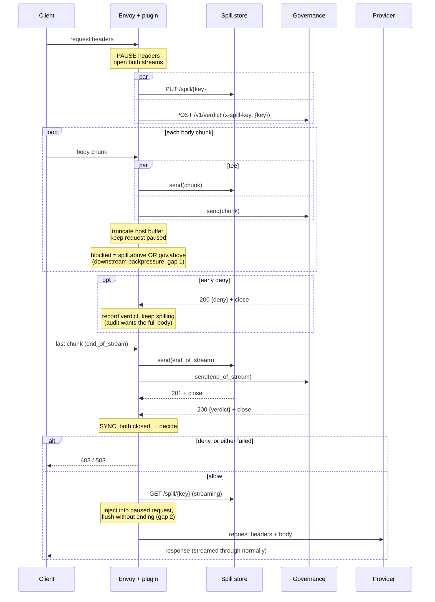

# Worked example: tee, govern, sync, then forward

This walks through a governance gateway built on the proposed streaming
HTTP calls (`proxy_http_stream` and friends). Its job is to check
every request before it reaches an inference provider. It is not part
of the spec. It's here to test whether the ABI is enough for a real
use case, and to show where it isn't.

## Scope

This covers **synchronous** governance only: the verdict blocks the
request. Asynchronous modes, where requests are governed after the fact
or in parallel, are a later step once this "poke and sniff" path works,
and are out of scope here.

## Scenario

Clients send inference requests to Envoy, which routes them to an
inference provider. Before any byte of a request reaches the provider:

1. The raw request body is **teed** to two streaming calls at once:
   - the **spill store**, which keeps the raw request for audit and for
     the later async modes;
   - the **governance** endpoint, which scans the content as it arrives
     and may deny early.

   The body may be larger than the Wasm VM's memory, so the plugin
   must never hold all of it. There are two options for the host side:
   - **Option A (unbounded):** the host doesn't hold the body either.
     Shown in full below.
   - **Option B (capped):** the host buffers the body up to a cap, and
     anything bigger is spiked with a 413. See
     [Option B](#option-b-cap-the-size-buffer-in-the-host-spike-anything-bigger).
     It needs nothing beyond this proposal.
2. The plugin **syncs**: it waits until both calls have closed,
   whatever their outcome (allowed, denied early, failed, or timed out),
   and decides only then.
3. If allowed, the request goes to the provider unchanged. Otherwise
   the client gets an error and the provider never sees anything.

Upstreams configured in the host:

| Name | Purpose |
|---|---|
| `spill` | Spill store that accepts a streaming (chunked) `PUT` and serves `GET` |
| `governance` | Streaming verdict endpoint: request body in, verdict JSON out |
| (route) | The inference provider, reached through normal Envoy routing |

The plugin picks the spill key before either call is opened. It sends
the key to governance in a request header, so governance can correlate
the two, or read the spill itself if it wants to re-scan.

The spill store needs to accept a chunked upload of unknown length.
Plain S3 `PUT` doesn't, so in practice this is a small spill service in
front of an object store, using multipart upload, or a store that
accepts chunked uploads natively.

## Sequence (Option A)



## Plugin logic (Option A)

Pseudocode against the raw ABI, for one downstream request context
`ctx`.

```text
state per ctx:
  key                              -- spill object key
  spill  = {id, above=false, done=false, ok=false}
  gov    = {id, above=false, done=false, ok=false, verdict=none}
  req_eos = false                  -- downstream body fully received
  -- the SDK maps spill.id and gov.id back to ctx

-- Phase 1: open both legs ---------------------------------------------

on_request_headers(ctx, eos):
  key = hex(random_get(16))                    -- or derived from x-request-id
  spill.id = proxy_http_stream(PARENT, "spill",
               [PUT /spill/{key}, content-type octet-stream], eos, timeout = 0)
  gov.id   = proxy_http_stream(ctx, "governance",
               [POST /v1/verdict, x-spill-key: key, + selected client headers],
               eos, timeout = 30000)
  return PAUSE                                 -- nothing goes to the provider yet

-- PARENT: parent the spill to the *plugin* context, not ctx, so that a
-- client abort doesn't reset it, and audit keeps the partial body. The
-- governance leg is parented to ctx, since it's useless once the client
-- is gone.

-- Phase 1: tee ----------------------------------------------------

blocked() = spill.above or gov.above           -- slowest leg sets the pace

on_request_body(ctx, body_size, eos):
  req_eos = eos
  if not blocked(): drain(ctx)
  return PAUSE                                 -- see gap 1

drain(ctx):
  n = proxy_get_buffer_status(ctx, HTTP_REQUEST_BODY)
  chunk = proxy_get_buffer_bytes(ctx, HTTP_REQUEST_BODY, 0, n)
  if not spill.done: proxy_http_stream_send(spill.id, chunk, req_eos)
  if not gov.done:   proxy_http_stream_send(gov.id,   chunk, req_eos)
  proxy_set_buffer_bytes(ctx, HTTP_REQUEST_BODY, 0, n, "")   -- drop from host buffer
  free(chunk)                                  -- plugin memory stays O(chunk)

on_http_stream_backpressure(id, above):
  leg(id).above = above
  if not blocked(): drain(ctx)                 -- allowed: request is paused

-- Responses on the legs (reused callbacks, keyed by leg id) --------------

on_response_body(gov.id, n, eos):
  return PAUSE until eos                       -- verdict is small: buffer it
  -- at eos: gov.verdict = parse(proxy_get_buffer_bytes(gov.id, HTTP_RESPONSE_BODY, ...))

on_response_headers(spill.id, status, eos): spill.status = status

-- Phase 2: sync ------------------------------------------------------

on_http_stream_close(id):
  (status, msg) = proxy_get_status(id)
  leg(id).done = true
  leg(id).ok   = status in 2xx
  -- An early deny closes gov before req_eos. Leave the downstream
  -- request paused and keep draining into spill only, so the audit copy
  -- is complete. (Policy choice: you could instead reply 403 right away
  -- and let the spill end short.)
  if spill.done and gov.done: decide(ctx)

decide(ctx):                                   -- reached on every path
  if not gov.ok or not spill.ok:
    proxy_send_local_response(ctx, 503, "governance unavailable", ...)   -- fail closed
  elif gov.verdict.deny:
    proxy_send_local_response(ctx, 403, gov.verdict.reason, ...)
  else:
    forward(ctx)

-- Phase 3: forward --------------------------------------------------

forward(ctx):
  fetch_id = proxy_http_stream(ctx, "spill", [GET /spill/{key}], end_of_stream = true, 0)

on_response_body(fetch_id, n, eos):
  chunk = proxy_get_buffer_bytes(fetch_id, HTTP_RESPONSE_BODY, 0, n)
  proxy_set_buffer_bytes(ctx, HTTP_REQUEST_BODY, MAX, 0, chunk)   -- append to paused request
  -- ??? flush this to the provider without ending the request (gap 2)
  if eos: proxy_continue_stream(ctx, HTTP_REQUEST)
  return CONTINUE
```

### Notes on the sync

- **Every path reaches `decide()` exactly once.** That's because
  `proxy_on_http_stream_close` is guaranteed to fire exactly once per
  leg: on success, early close, timeout, upstream reset, or parent
  teardown. The spec should keep that guarantee firm.
- **When the client aborts**, `ctx` is torn down. The governance leg
  (parented to `ctx`) gets its close callback before the request
  context is finalized, as the spec requires. The spill leg (parented to
  the plugin context) survives, so the plugin must end it explicitly.
  Ending it with `end_of_stream` would make a truncated body look
  complete, so it should be reset with `proxy_close_stream`, which
  marks the audit copy as partial. A hook for that is the request's
  finalize callback (`proxy_on_done`/`proxy_on_log` today,
  `proxy_on_context_finalize` after #110).
- **Early deny** is a policy choice:
  - *Respond now:* send 403 immediately, then reset the spill (partial
    audit) or keep reading the body to finish it. Reading after a local
    response is host-dependent, since Envoy will usually reset the
    request.
  - *Respond at sync:* keep the client uploading and reply after both
    legs close. That gives a complete audit, at the cost of latency on
    denied requests. The pseudocode does this.
- **Fan-out is a join on backpressure.** The plugin drains only when
  *every* live leg is below its limit. That needs per-leg state in the
  plugin, but nothing new in the ABI. A leg that has closed (e.g. an
  early deny) stops counting.

## Gaps this exposes

For Option A, streaming callouts are necessary but not sufficient.
Working through it turns up two gaps in the existing downstream HTTP
interface. Option B avoids both. There's also one possible
optimization that applies to both options.

### Gap 1: `PAUSE` on a body means "buffer", not "backpressure"

The spec only has `CONTINUE` and `PAUSE`. In Envoy, `PAUSE` (`1`) from
a body callback maps to `StopIterationAndBuffer`. When the buffered body
goes over the buffer limit, Envoy answers with **413 Payload Too Large**
instead of applying backpressure to the client.

- While both legs keep up, this is fine: `drain()` truncates the host
  buffer to zero on every chunk.
- When either leg pushes back, the plugin stops draining. The host
  buffer then grows until Envoy returns 413. The plugin has no way to
  tell Envoy to stop reading from the client.

Envoy already supports `StopIterationAndWatermark` (stop forwarding,
apply backpressure to downstream via watermarks), and proxy-wasm-cpp-host
passes raw return values through unchecked (`2` = `StopIterationAndWatermark`,
`3` = `StopIterationNoBuffer`). The Rust SDK's `Action` and the spec stop
at `PAUSE`, though. Issue #63 ("more control over buffering") is where
this belongs. A spec-level `PAUSE_WITH_BACKPRESSURE`, or a statement that
`PAUSE` applies backpressure instead of failing, would close this gap.

The spec text for `proxy_on_http_stream_backpressure` now says that
leaving data in a paused request's buffer only throttles the downstream
if the host applies backpressure while paused, instead of failing the
request. The PR description links #63.

### Gap 2: no way to inject a streamed body into a paused request

After the verdict, the original body exists only in the spill store. To
send it to the provider through normal routing, the plugin has to append
chunks fetched from the store to the paused downstream request and
**flush each one without ending the request**. Today:

- `proxy_continue_stream(ctx, HTTP_REQUEST)` forwards whatever is
  buffered. Downstream `end_of_stream` was already seen, so the request
  ends there and later chunks can't be added.
- Buffering the whole re-fetched body before continuing defeats the
  purpose, and it hits the 413 from gap 1 anyway.

What's needed is "flush partial body" (#65) plus control of
`end_of_stream` (#64). Hosts also need to allow a paused request to keep
being written to after downstream `end_of_stream`.

### Optimization: tee without copying through Wasm memory

Each chunk currently crosses the Wasm boundary three times: it's read
once, then copied into each leg. A hostcall that sends straight from
a host buffer would make the tee zero-copy, and would keep the body out
of the VM entirely when the plugin doesn't need to look at it:

```text
proxy_http_stream_send_buffer(stream_id, source_context_id, buffer_id,
                              start, size, end_of_stream)
```

In Envoy, copying a `Buffer::Instance` into another one moves slices
cheaply, without a deep copy. This isn't needed for correctness, so
it's an open question for the PR, not part of it.

### Alternative: send to the provider as a callout as well

The plugin could open another streaming call to the provider and pipe
spill `GET` → provider. That uses only this proposal, with backpressure
through `proxy_on_http_stream_backpressure`. Relaying the provider's
response back to the client, however, needs a **streaming local
response**: `proxy_send_local_response` takes the complete body, and
inference responses are usually streamed (SSE). The request would also
skip Envoy's routing, retries, load balancing and access logging for the
provider hop. Not recommended, but it shows streaming local responses
are another gap.

### Option B: cap the size, buffer in the host, spike anything bigger

This is a fully valid alternative to the unbounded flow above. Pick
a cap (say 256 MiB) and reject ("spike") any request above it with
a 413. The cap must be allowed to exceed the Wasm VM's memory, because
the body is held in **host** memory, and Wasm memory stays O(chunk).

Host configuration: the host's request buffer limit must be at least
the cap. In Envoy, that's the connection/route buffer limit, which
defaults to 1 MiB, so it has to be raised.

Changes to the plugin, compared with the unbounded flow:

```text
state per ctx:  + tee_off = 0          -- bytes already sent to the legs

on_request_headers(ctx, eos):
  cl = content-length header
  if cl > CAP: proxy_send_local_response(ctx, 413, "too large", ...); return PAUSE
  ...open both legs as before...

on_request_body(ctx, body_size, eos):   -- body_size = everything buffered so far
  req_eos = eos
  if body_size > CAP:                   -- chunked bodies have no content-length
    reset legs; proxy_send_local_response(ctx, 413, ...); return PAUSE
  if not blocked(): tee(ctx)
  return PAUSE                          -- keep it all in the host buffer

tee(ctx):                               -- no truncation: read from the offset
  n = proxy_get_buffer_status(ctx, HTTP_REQUEST_BODY) - tee_off
  chunk = proxy_get_buffer_bytes(ctx, HTTP_REQUEST_BODY, tee_off, min(n, CHUNK))
  send chunk to each live leg (end_of_stream once tee_off reaches the end and req_eos)
  tee_off += len(chunk)
  free(chunk)
  (repeat until caught up or blocked())

decide(ctx) on allow:
  proxy_continue_stream(ctx, HTTP_REQUEST)   -- forwards the original buffered body
```

Why both gaps go away:

- **Gap 2 (re-injection):** the original body is still in the host
  buffer, so allowing the request is a single `proxy_continue_stream`.
  There's no spill `GET` and no need to flush part of the body.
- **Gap 1 (`PAUSE` isn't backpressure):** the host buffer grows at
  the client's pace either way, and the legs read from `tee_off`
  without truncating it. A slow leg just means `tee_off` falls behind,
  and it catches up in `on_http_stream_backpressure(above=false)`, which
  is allowed while the request is paused. Envoy's 413 on buffer overflow
  can now only happen to bodies over the cap, and those are spiked
  anyway.
- **Gap 1, residual:** the client is never slowed down. It can upload
  up to the cap as fast as it likes while the legs lag behind. That's a
  memory cost, not a correctness problem.

Costs and caveats:

- **Memory:** the worst case in host memory is
  `concurrent large requests × CAP`. That needs host-level protection,
  such as Envoy's overload manager, or a limit on concurrent large
  requests.
- **Clean 413s:** check `content-length` up front, to reject before
  opening any legs. Also check the running `body_size`, because chunked
  bodies don't send a length. The plugin's cap should be a little below
  the host's buffer limit, so that the plugin's 413 (which can carry an
  audit record) fires before Envoy's generic one.
- **Spike and audit:** a spiked request is torn down. The governance
  leg closes along with it. The spill leg, if parented to the plugin
  context, should be reset (partial) or completed, depending on whether
  spiked requests are worth auditing.

So Option B needs **nothing beyond this proposal**, and it's probably
the right first implementation. The unbounded flow (Option A, above)
is what motivates #63, #64 and #65.

### Not a fix: forward right away, judge the response

Forward to the provider right away (`CONTINUE`), tee in parallel,
and hold the *response* (`PAUSE` in `proxy_on_response_headers`) until
the verdict arrives. This works today and doesn't depend on body size,
but the provider sees the request before it's approved, so it isn't
synchronous governance. It belongs with the asynchronous modes that are
out of scope here, as a "don't return output" policy rather than "don't
send input". It also needs nothing beyond this proposal, which is
useful to know for that later work.

## Today, with gRPC streams

The ABI already has streaming gRPC calls (`proxy_grpc_stream`,
`proxy_grpc_send`, `proxy_on_grpc_*`). They exist in v0.2.1 and are
implemented in Envoy. So could a prototype run on current Envoy without
this proposal? Partly. Findings from the spec and Envoy's
`source/extensions/common/wasm/context.cc`:

**What works:**
- **Tee:** open one gRPC stream to a spill service and one to
  a governance service, and `proxy_grpc_send` each body chunk to both
  as a message (e.g. `bytes chunk`). Plugin memory stays O(chunk), and
  the host does the gRPC framing.
- **Early deny:** streams are bidirectional, so governance can send a
  verdict message while the upload is still in progress.
- **Outliving the request:** `parent_context_id` may be the plugin
  context, so the spill stream can outlive the request.
- **Option B** (cap, buffer in the host, tee from an offset) applies
  unchanged.

**What's missing:**

| Need | gRPC streams today |
|---|---|
| Send-side backpressure | None. `proxy_grpc_send` always accepts, and nothing tells the plugin when a stream is backed up. Envoy's async gRPC stream tracks this (`isAboveWriteBufferHighWatermark`), but Proxy-Wasm doesn't expose it. |
| Exactly-once close | No. `proxy_on_grpc_close` fires only when the remote side closes. `proxy_grpc_cancel` erases the stream with no callback. When the parent context is torn down, Envoy's `~Context` calls `resetStream()` silently, after `onDone`/`onDelete`. |
| Timeout | None. The spec text for `proxy_grpc_stream` mentions a timeout, but the hostcall takes none, and Envoy doesn't set one. A hung governance stream hangs the request. |
| Plain HTTP endpoints | No. Both services must speak gRPC. That's fine for services you own, but it rules out talking to an object store or an existing HTTP governance API directly. |

### Workaround: flow control in the application protocol

If you own both services, you can rebuild the missing pieces on top
of what exists:

- **Window per stream.** Each service periodically sends back an ack
  message saying it has received up to byte N, which arrives through
  `proxy_on_grpc_receive`. The plugin caps bytes in flight per stream:

  ```text
  in_flight = tee_off - acked_off
  while in_flight < WINDOW and data buffered: send next chunk
  on ack(n): acked_off = n; tee(ctx)
  ```

- **Timeout.** Start a one-shot timer (`proxy_create_timer`) per
  request. When it fires, call `proxy_grpc_cancel` on both streams and
  reply 503.
- **Waiting for both streams.** Treat "remote closed", "cancelled by
  me" and "timed out" as the same done state in plugin-side bookkeeping,
  because only the first of them produces a callback.
- **Client abort.** There's no callback for a governance stream torn
  down with its request. The spill stream, parented to the plugin
  context, must be cancelled from the request's `proxy_on_done` /
  `proxy_on_log`, so that it's recorded as partial.

Costs: throughput is limited to about one window per round trip, both
services need a custom protocol, and the plugin carries bookkeeping that
the ABI should provide. That's acceptable for a "poke and sniff"
prototype on current Envoy, but not as the long-term design.

### What this means for the proposal

The gRPC path shows that the flow can be built. The streaming HTTP call
proposal provides, as part of the ABI, exactly what the gRPC path is
missing: host-driven backpressure, exactly-once close (including on
reset and parent teardown), a real timeout, and plain HTTP endpoints.
For parity, gRPC streams would need the same three things.


## Takeaways for the PR

1. Option B (cap, buffer in the host, spike anything bigger) works
   end to end with only this proposal, and is the likely first
   implementation. The PR can give it as the motivating example.
2. The proposal fully covers phase 1 (tee to N legs with joined
   backpressure) and phase 2 (sync on the close callbacks). The
   exactly-once guarantee of `proxy_on_http_stream_close`, including on
   parent teardown, is what makes the sync reliable, so the PR should
   point that out.
3. Parenting a call to the plugin context, so it outlives the request
   (the spill leg above), is a real use. The PR should keep it, and
   could give it as the example of when a call should outlive the
   request that started it.
4. The unbounded end-to-end flow (Option A) also depends on #63 (backpressure-style
   pause) and #64/#65 (flush and `end_of_stream` control). The PR
   should say so and link them, so reviewers see the whole path.
5. The `proxy_on_http_stream_backpressure` text should say that pausing
   the downstream request only gives backpressure if the host's pause
   doesn't fail on buffer overflow (see gap 1).
6. gRPC streams can run Option B today, using flow control built into
   the application protocol, but they lack backpressure, exactly-once
   close and a timeout. That's the case for giving them the same
   treatment (see "Today, with gRPC streams").
7. Open question: a zero-copy `proxy_http_stream_send_buffer`, for
   tee or mirroring.
